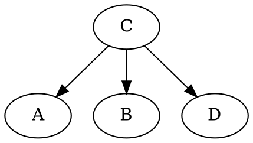

# 理论作业二

## 一

$\begin{aligned}
    &(1)不独立\quad&(2)不独立\quad&(3)不独立\quad&(4)不独立\quad&(5)独立\\
    &(6)独立\quad&(7)独立\quad&(8)不独立\quad&(9)独立\quad&(10)不独立\\
    &(11)不独立\\
\end{aligned}$

---

## 二

---

## 三

由图可知：

$$P(E,S,M,B)=P(E)\cdot P(S|E,M)\cdot P(M)\cdot P(B|M)$$

### (1)

因此：

$$P(E=F,S=F,M=F,B=F)=0.6\cdot0.9\cdot0.9\cdot0.9=0.4374$$

### (2)

$B$与$E,S$独立。

$$\begin{aligned}
    P(B=T)&=P(M=T,B=T)+P(M=F,B=T)\\
    &=1.0\cdot0.1+0.1\cdot0.9=0.19
\end{aligned}$$

### (3)

$$\begin{aligned}
    P(M=T|B=T)&=\dfrac{P(B=T|M=T)\cdot P(M=T)}{P(B=T)}\\
    &=\dfrac{1.0\cdot0.1}{0.19}=0.5263
\end{aligned}$$

### (4)

$$\begin{aligned}
    P(M=T|E=T,S=T,B=T)&=\dfrac{P(M=T,E=T,S=T,B=T)}{P(E=T,S=T,B=T)}\\
    &=\dfrac{P(M=T,E=T,S=T,B=T)}{P(M=T,E=T,S=T,B=T)+P(M=F,E=T,S=T,B=T)}\\
    &=\dfrac{0.4\cdot0.1\cdot1.0\cdot1.0}{0.4\cdot0.1\cdot1.0\cdot1.0+0.4\cdot0.9\cdot0.8\cdot0.1}\\
    &=0.5814
\end{aligned}$$

### (5)

$E,M$独立，故：

$$\begin{aligned}
    P(E=T|M=T)&=\dfrac{P(E=T,M=T)}{P(M=T)}\\
    &=\dfrac{P(E=T)\cdot P(M=T)}{P(M=T)}\\
    &=P(E=T)=0.4
\end{aligned}$$
